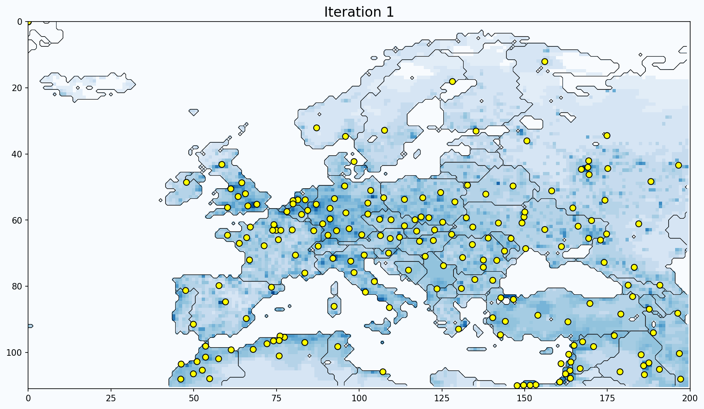

### 🗺 Weighted K-Means on Global Population Grid

In this project, we simulate the optimal placement of factories to minimize shipping costs using a **weighted k-means clustering** algorithm applied on a real-world population density map.

- 📍 Each pixel represents a geographic location with population weight  
- 🏭 Clusters represent ideal factory locations  
- 🧠 Weighted k-means iteratively assigns locations to nearest factories and shifts factory positions

#### Highlights
- Data: Global population grid (SEDAC, Columbia University)
- Clustering Objective: Weighted minimization of squared distances
- Result: 200 production plant locations optimized over 50 iterations
- Tools: NumPy, Matplotlib, SciPy

🗂 All results and visualizations saved in the `plots/` directory.
